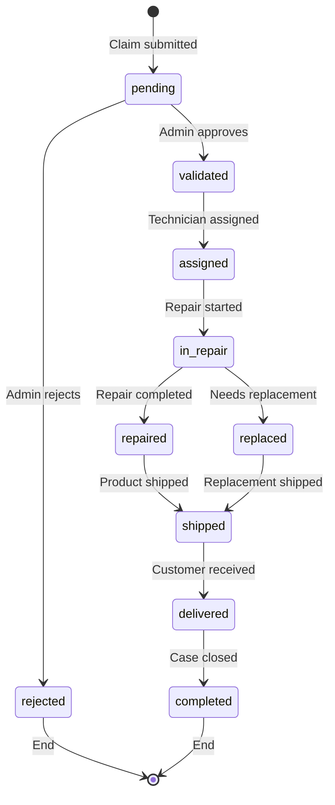
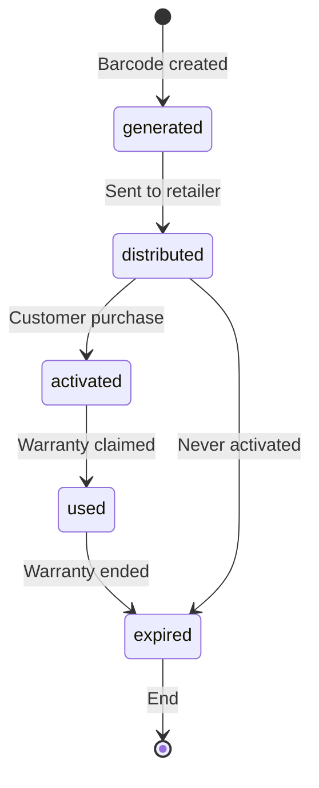

# Rexus Gaming Warranty System - Complete Flow Documentation

## Table of Contents
1. [System Overview](#system-overview)
2. [User Perspective Flow](#user-perspective-flow)
3. [Admin Perspective Flow](#admin-perspective-flow)
4. [Data Models & States](#data-models--states)
5. [Business Rules](#business-rules)
6. [Integration Points](#integration-points)

---

## System Overview

The Rexus Gaming Warranty System is a comprehensive warranty management platform that enables:
- **Warranty Registration** via QR codes and manual entry
- **Claim Submission** with photo/document uploads
- **Status Tracking** throughout the warranty lifecycle
- **Admin Management** of claims, repairs, and logistics
- **Automated Notifications** for status updates

### Core Components:
- **Warranty Barcodes/QR Codes**: Unique identifiers for each product
- **Customer Portal**: Warranty lookup, claim submission, and tracking
- **Admin Dashboard**: Claim management, repair workflow, and reporting
- **Logistics Integration**: Shipping coordination for repairs/replacements

---

## User Perspective Flow

### 1. Warranty Registration & Lookup

#### 1.1 Initial Access
**Entry Points:**
- Direct URL: `/warranty`
- Navigation from main website
- QR code scan from product packaging

**User Journey:**
```
Landing Page → Warranty Lookup → Product Details → Action (Register/Claim)
```

#### 1.2 Warranty Lookup Methods

**Method A: Manual ID Entry**
1. User enters warranty ID (format: `WR######`)
2. System validates ID format and existence
3. Returns product warranty information
4. Shows warranty status and expiry date

**Method B: QR Code Scanning**
1. User clicks "Scan QR Code"
2. Camera permission requested
3. QR code scanned from product/packaging
4. Automatic ID extraction and lookup
5. Product warranty details displayed

**Method C: Warranty History (Registered Users)**
1. Display user's past warranty registrations
2. Show warranty status for each product
3. Quick access to warranty details and claims

### 2. Warranty Details View

#### 2.1 Active Warranty Display
**Information Shown:**
- ✅ Product name and model
- ✅ Serial number
- ✅ Purchase date
- ✅ Warranty expiry date
- ✅ Warranty status badge
- ✅ Available actions (Claim Warranty button)

#### 2.2 Warranty Status Types
| Status | Description | User Actions Available |
|--------|-------------|----------------------|
| `active` | Valid, unexpired warranty | Submit claim, View details |
| `expired` | Warranty period ended | Contact support only |
| `claimed` | Warranty claim in progress | Track claim status |

### 3. Warranty Claim Submission

#### 3.1 Claim Form Process
**Step 1: Issue Description**
```
User Input Required:
- Issue category (dropdown)
- Detailed description (textarea)
- Problem occurrence date
```

**Step 2: Customer Information**
```
Required Fields:
- Full name *
- Email address *
- Phone number
- Complete address for pickup/delivery
```

**Step 3: Supporting Documents**
```
Upload Options:
- Purchase receipt/invoice (required)
- Product photos showing issue
- Additional documentation
File Formats: JPG, PNG, PDF (max 5MB each)
```

**Step 4: Logistics Selection**
```
Shipping Options:
- JNE Express (2-3 business days)
- J&T Express (1-2 business days)
- SiCepat (2-4 business days)
- AnterAja (2-3 business days)
- Pos Indonesia (3-5 business days)
- Self Pickup (visit service center)
```

#### 3.2 Claim Submission Confirmation
**Success Response:**
- Claim reference ID generation (`WC-YYYY-MM-###`)
- Estimated processing timeline
- Contact information for support
- Email confirmation sent
- Status tracking instructions

### 4. Claim Status Tracking

#### 4.1 Status Timeline View
**User can track claim through:**
```
1. Submitted → Pending validation
2. Validated → Approved for repair/replacement
3. In Repair → Product being serviced
4. Repaired → Ready for shipment
5. Shipped → En route to customer
6. Completed → Case closed
```

**Alternative paths:**
- `Rejected` → Claim denied with reason
- `Replaced` → New product shipped

#### 4.2 Status Notifications
**Communication Channels:**
- Email notifications for status changes
- SMS updates for critical milestones
- In-app notifications when logged in

---

## Admin Perspective Flow

### 1. Admin Dashboard Overview

#### 1.1 Key Metrics Display
**Statistics Cards:**
- Total warranty barcodes generated
- Active unused barcodes
- Pending claims requiring attention
- Claims in repair process
- Completed claims this period

#### 1.2 Quick Access Panels
- Recent warranty claims list
- Product warranty status overview
- Urgent actions required
- Performance metrics

### 2. Barcode Generation & Management

#### 2.1 Barcode Generation Workflow
**Process:**
1. Admin selects product from dropdown
2. Specifies quantity (1-1000 barcodes)
3. System generates unique barcode numbers
4. QR codes created with warranty claim URLs
5. Batch ready for printing/distribution

**Barcode Format:**
```
Pattern: REX[YY][RANDOM_12]
Example: REX24A7M9K2P8Q1N5
Components:
- REX: Brand prefix
- YY: Generation year (2 digits)
- RANDOM_12: Cryptographically secure random alphanumeric string (12 chars)
  - Uses: A-Z, 0-9 (excluding I, O, 1, 0 to avoid confusion)
  - Total possibilities: 32^12 ≈ 1.2 × 10^18 combinations
  - Collision probability: <0.001% even with billions of codes
```

**Generation Algorithm:**
```
Character set: ABCDEFGHJKLMNPQRSTUVWXYZ23456789 (32 chars)
Method: Cryptographically secure random generator (CSPRNG)
Uniqueness: Database constraint + retry mechanism
Entropy: ~60 bits of entropy per barcode
```

#### 2.2 Barcode Lifecycle Management
**States:**
- `Generated` → Created but not distributed
- `Distributed` → Sent to retailers/packaging
- `Activated` → Customer registered warranty
- `Used` → Warranty claim submitted
- `Expired` → Warranty period ended

### 3. Warranty Claims Management

#### 3.1 Claim Processing Workflow

**Step 1: Initial Review**
```
Admin Actions Available:
- View complete claim details
- Review customer information
- Examine uploaded documents/photos
- Verify warranty validity
- Check purchase date authenticity
```

**Step 2: Validation Decision**
```
Approve:
- Mark as "Validated"
- Assign to repair queue
- Send approval notification to customer

Reject:
- Mark as "Rejected"
- Add rejection reason
- Send denial notification with explanation
```

**Step 3: Repair Process Management**
```
Admin Controls:
- Assign to technician
- Set repair timeline
- Track repair progress
- Add repair notes
- Manage parts/labor costs
- Update estimated completion
```

**Step 4: Quality Assurance**
```
Post-Repair Actions:
- Mark repair as complete
- Add final inspection notes
- Trigger shipping process
- Generate shipping label
```

**Step 5: Shipping Coordination**
```
Logistics Management:
- Select shipping provider
- Enter tracking number
- Set estimated delivery date
- Send tracking info to customer
- Monitor delivery status
```

#### 3.2 Claim Status Management

**Status Transition Rules:**
```
pending → [validated | rejected]
validated → in_repair
in_repair → [repaired | replaced]
repaired → shipped
replaced → shipped
shipped → completed
```

**Admin Actions by Status:**
| Status | Available Actions |
|--------|-------------------|
| `pending` | Validate, Reject, Request more info |
| `validated` | Start repair, Assign technician |
| `in_repair` | Update progress, Mark complete |
| `repaired` | Initiate shipping, QA check |
| `shipped` | Track delivery, Contact customer |
| `completed` | Archive, Generate report |

### 4. Repair Workshop Management

#### 4.1 Technician Assignment
**Process:**
- View available technicians
- Check workload capacity
- Assign claim to technician
- Set expected completion date
- Notify technician of assignment

#### 4.2 Repair Tracking
**Components:**
- Repair steps checklist
- Parts required/ordered
- Labor time tracking
- Quality checkpoints
- Photo documentation of repair

#### 4.3 Repair Documentation
**Required Information:**
- Diagnosis notes
- Parts used with costs
- Labor hours
- Before/after photos
- Testing results
- Final inspection report

### 5. Reporting & Analytics

#### 5.1 Warranty Performance Reports
**Metrics Tracked:**
- Claim volume trends
- Processing time averages
- Rejection rates by product
- Customer satisfaction scores
- Cost analysis (repair vs replacement)

#### 5.2 Product Quality Insights
**Analysis Available:**
- Common failure patterns
- Warranty claim frequency by product
- Defect categorization
- Supplier quality metrics

---

## Data Models & States

### 1. Core Data Entities

#### 1.1 Product
```typescript
interface Product {
  id: string;
  name: string;
  sku: string;
  category: string;
  warrantyPeriod: number; // months
  price: number;
  isActive: boolean;
}
```

#### 1.2 Warranty Barcode
```typescript
interface WarrantyBarcode {
  id: string;
  productId: string;
  barcodeNumber: string; // REX24A7M9K2P8Q1N5
  qrCodeData: string; // URL for warranty claims
  generatedAt: string;
  distributedAt?: string;
  activatedAt?: string;
  purchaseDate?: string;
  customerId?: string;
  status: 'generated' | 'distributed' | 'activated' | 'used' | 'expired';
  expiryDate?: string;
  // Entropy and security tracking
  entropy: number; // Bits of entropy in the random portion
  generationMethod: 'CSPRNG'; // Cryptographically secure random
  collisionChecked: boolean; // Uniqueness verified against existing codes
  retailerInfo?: {
    name: string;
    location: string;
    batchNumber: string;
  };
}
```

#### 1.3 Customer
```typescript
interface Customer {
  id: string;
  name: string;
  email: string;
  phone: string;
  address: {
    street: string;
    city: string;
    province: string;
    postalCode: string;
    country: string;
  };
  registeredAt: string;
  isVerified: boolean;
}
```

#### 1.4 Warranty Claim
```typescript
interface WarrantyClaim {
  id: string;
  claimNumber: string; // WC-YYYY-MM-###
  barcodeId: string;
  customerId: string;
  productId: string;
  
  // Issue Information
  issueDescription: string;
  issueCategory: string;
  issueDate: string;
  severity: 'low' | 'medium' | 'high' | 'critical';
  
  // Dates
  claimDate: string;
  purchaseDate: string;
  validatedAt?: string;
  completedAt?: string;
  
  // Status & Processing
  status: ClaimStatus;
  validatedBy?: string;
  assignedTechnicianId?: string;
  estimatedCompletionDate?: string;
  actualCompletionDate?: string;
  
  // Resolution
  resolutionType?: 'repair' | 'replace' | 'refund';
  repairNotes?: string;
  replacementProductId?: string;
  refundAmount?: number;
  
  // Costs
  repairCost?: number;
  shippingCost?: number;
  replacementCost?: number;
  
  // Logistics
  pickupAddress: Address;
  shippingProvider?: string;
  trackingNumber?: string;
  estimatedDelivery?: string;
  
  // Documentation
  attachments: ClaimAttachment[];
  photos: ClaimPhoto[];
  
  // Communication
  customerNotes?: string;
  adminNotes?: string;
  rejectionReason?: string;
  
  // Metadata
  createdAt: string;
  updatedAt: string;
  priority: 'low' | 'normal' | 'high' | 'urgent';
}
```

#### 1.5 Claim Status Types
```typescript
type ClaimStatus = 
  | 'pending'        // Awaiting validation
  | 'validated'      // Approved for processing
  | 'rejected'       // Claim denied
  | 'assigned'       // Assigned to technician
  | 'in_repair'      // Being repaired
  | 'repaired'       // Repair completed
  | 'replaced'       // Product replaced
  | 'shipped'        // Sent back to customer
  | 'delivered'      // Customer received
  | 'completed'      // Case closed
  | 'cancelled'      // Customer cancelled
  | 'disputed'       // Under review
```

#### 1.6 Repair Ticket
```typescript
interface RepairTicket {
  id: string;
  claimId: string;
  technicianId: string;
  
  // Scheduling
  assignedAt: string;
  startDate: string;
  targetCompletionDate: string;
  actualCompletionDate?: string;
  
  // Process
  status: 'assigned' | 'in_progress' | 'waiting_parts' | 'completed' | 'failed';
  diagnosis: string;
  repairSteps: RepairStep[];
  
  // Parts & Costs
  partsUsed: PartUsage[];
  laborHours: number;
  totalCost: number;
  
  // Documentation
  beforePhotos: string[];
  afterPhotos: string[];
  testResults: TestResult[];
  qualityCheckPassed: boolean;
  
  // Notes
  technicianNotes: string;
  qualityNotes?: string;
}
```

### 2. State Machines

#### 2.1 Warranty Claim State Machine


#### 2.2 Barcode Lifecycle


---

## Business Rules

### 1. Warranty Eligibility
- Product must be purchased within warranty period
- Original purchase receipt required
- Product serial number must match barcode
- Customer must be original purchaser
- Warranty void if tampered/modified
- Physical damage not covered (varies by product)

### 2. Claim Processing Rules
- Claims must be submitted before warranty expiry
- Supporting documentation required within 7 days
- Response time: 2-3 business days for validation
- Repair time: 5-10 business days average
- Replacement authorized if repair cost > 70% of product value
- Maximum 3 warranty claims per product

### 3. Shipping & Logistics
- Free pickup and return shipping for warranty claims
- Customer can choose pickup location
- Tracking information provided for all shipments
- Delivery attempted 3 times before return to sender
- Customer notified 24 hours before pickup

### 4. Communication Rules
- Email confirmation sent within 1 hour of claim submission
- Status updates sent within 24 hours of changes
- SMS notifications for critical milestones
- Customer can contact support via provided channels
- Response time: 4 hours during business hours

---

## Integration Points

### 1. External Systems
- **Email Service**: SendGrid/AWS SES for notifications
- **SMS Gateway**: Twilio for SMS updates
- **Storage**: AWS S3/CloudFlare for document storage
- **Logistics APIs**: JNE, J&T, SiCepat for shipping
- **Payment Gateway**: For refund processing

### 2. Internal Systems
- **User Management**: Customer authentication
- **Product Catalog**: Product information sync
- **Inventory**: Stock levels for replacements
- **CRM**: Customer service integration
- **Analytics**: Performance tracking

### 3. Third-Party Tools
- **QR Code Generator**: For barcode creation
- **Document Scanner**: OCR for receipt validation
- **Image Processing**: Photo compression/validation
- **Reporting**: Business intelligence tools

---

## Implementation Considerations

### 1. Secure Barcode Generation Implementation

#### 1.1 Algorithm Implementation
```typescript
class SecureBarcodeGenerator {
  private readonly CHARACTER_SET = 'ABCDEFGHJKLMNPQRSTUVWXYZ23456789';
  private readonly RANDOM_LENGTH = 12;
  private readonly MAX_RETRIES = 3;

  async generateBarcode(year: number = new Date().getFullYear()): Promise<string> {
    const yearSuffix = year.toString().slice(-2);
    
    for (let attempt = 0; attempt < this.MAX_RETRIES; attempt++) {
      // Generate cryptographically secure random string
      const randomPart = this.generateSecureRandom(this.RANDOM_LENGTH);
      const barcode = `REX${yearSuffix}${randomPart}`;
      
      // Check uniqueness in database
      const isUnique = await this.checkUniqueness(barcode);
      if (isUnique) {
        await this.recordGeneration(barcode, attempt + 1);
        return barcode;
      }
      
      // Log collision for monitoring
      await this.logCollision(barcode, attempt + 1);
    }
    
    throw new Error('Failed to generate unique barcode after maximum retries');
  }

  private generateSecureRandom(length: number): string {
    const crypto = require('crypto');
    const randomBytes = crypto.randomBytes(length);
    
    return Array.from(randomBytes)
      .map(byte => this.CHARACTER_SET[byte % this.CHARACTER_SET.length])
      .join('');
  }
}
```

#### 1.2 Database Schema Considerations
```sql
-- Barcode table with optimized indexing
CREATE TABLE warranty_barcodes (
  id UUID PRIMARY KEY DEFAULT gen_random_uuid(),
  barcode_number VARCHAR(17) UNIQUE NOT NULL, -- REX + 2 + 12 chars
  product_id UUID NOT NULL REFERENCES products(id),
  generated_at TIMESTAMP DEFAULT NOW(),
  generation_attempt INTEGER DEFAULT 1,
  entropy_bits INTEGER DEFAULT 60,
  status VARCHAR(20) DEFAULT 'generated',
  
  -- Indexes for performance
  CONSTRAINT barcode_format_check CHECK (barcode_number ~ '^REX\d{2}[ABCDEFGHJKLMNPQRSTUVWXYZ23456789]{12}$'),
  INDEX idx_barcode_lookup (barcode_number),
  INDEX idx_product_barcodes (product_id, status),
  INDEX idx_generation_date (generated_at)
);

-- Collision tracking table for monitoring
CREATE TABLE barcode_collisions (
  id UUID PRIMARY KEY DEFAULT gen_random_uuid(),
  attempted_barcode VARCHAR(17) NOT NULL,
  collision_date TIMESTAMP DEFAULT NOW(),
  generation_attempt INTEGER,
  resolved_barcode VARCHAR(17),
  
  INDEX idx_collision_tracking (collision_date, generation_attempt)
);
```

#### 1.3 Performance Optimization
- **Database Connection Pooling**: Use connection pools to handle concurrent generation
- **Batch Generation**: Generate multiple codes in single transaction
- **Caching**: Cache character set and crypto instances
- **Monitoring**: Track generation performance and collision rates

#### 1.4 Security Measures
- **CSPRNG**: Use cryptographically secure random number generators
- **Character Set**: Exclude confusing characters (I, O, 1, 0)
- **Entropy Monitoring**: Track and alert on entropy degradation
- **Rate Limiting**: Prevent abuse of generation endpoints
- **Audit Logging**: Log all generation attempts and collisions

### 2. Scalability Considerations

#### 2.1 High-Volume Generation
- **Parallel Processing**: Generate codes in parallel across multiple workers
- **Distributed Generation**: Use multiple servers with coordination
- **Queue-Based Generation**: Use message queues for bulk generation requests
- **Load Balancing**: Distribute generation load across multiple instances

#### 2.2 Storage Optimization
- **Partitioning**: Partition barcode tables by generation year
- **Archiving**: Archive old/expired barcodes to reduce active dataset
- **Compression**: Compress historical data and attachments
- **CDN**: Use CDN for QR code images and documents

### 3. Monitoring & Alerting

#### 3.1 Key Metrics to Monitor
```typescript
interface BarcodeMetrics {
  generationRate: number;        // codes/second
  collisionRate: number;         // collisions/total_attempts
  uniquenessScore: number;       // percentage of unique codes
  averageGenerationTime: number; // milliseconds
  entropyUtilization: number;    // percentage of total entropy used
  systemLoad: number;            // CPU/memory usage during generation
}
```

#### 3.2 Alert Conditions
- **High Collision Rate**: >0.01% collision rate
- **Slow Generation**: >5ms average generation time
- **System Overload**: >80% CPU utilization during generation
- **Entropy Depletion**: >10% of total entropy space used
- **Database Errors**: Any database connectivity issues

### 4. Testing Strategy

#### 4.1 Unit Tests
- **Format Validation**: Test barcode format compliance
- **Uniqueness Testing**: Verify collision detection works
- **Character Set Testing**: Ensure only valid characters used
- **Performance Testing**: Measure generation speed under load

#### 4.2 Integration Tests
- **Database Integration**: Test with real database constraints
- **Concurrent Generation**: Test parallel generation scenarios
- **Collision Resolution**: Test collision handling mechanisms
- **API Integration**: Test through complete API workflows

#### 4.3 Load Testing
- **Burst Generation**: Test generating 10,000 codes simultaneously
- **Sustained Load**: Test continuous generation over hours
- **Memory Usage**: Monitor memory consumption during bulk generation
- **Database Performance**: Test database performance under load

### 5. Migration Strategy

#### 5.1 Transitioning from Sequential
```typescript
// Migration script for existing sequential codes
async function migrateExistingBarcodes() {
  const existingCodes = await db.query('SELECT * FROM barcodes WHERE format = "sequential"');
  
  for (const code of existingCodes) {
    // Maintain existing codes but mark as legacy
    await db.query(`
      UPDATE barcodes 
      SET generation_method = 'legacy_sequential',
          entropy_bits = 0,
          migration_notes = 'Pre-2024 sequential format'
      WHERE id = ?
    `, [code.id]);
  }
  
  // Update validation to accept both formats during transition
  await updateValidationRules();
}
```

#### 5.2 Gradual Rollout
1. **Phase 1**: Deploy new generation system alongside old
2. **Phase 2**: Generate new codes with secure method only
3. **Phase 3**: Update validation to accept both formats
4. **Phase 4**: Complete migration of legacy systems
5. **Phase 5**: Remove support for old format (after warranty periods expire)

---

## Next Steps: API Endpoint Requirements

This flow documentation serves as the foundation for defining the complete API specification that will support all warranty functionality, including:

- Authentication & authorization
- Warranty lookup and registration
- Claim submission and management
- Document upload and storage
- Status tracking and notifications
- Admin workflow management
- Reporting and analytics

The detailed API endpoints will be defined in the next section to cover all these flows and business requirements.